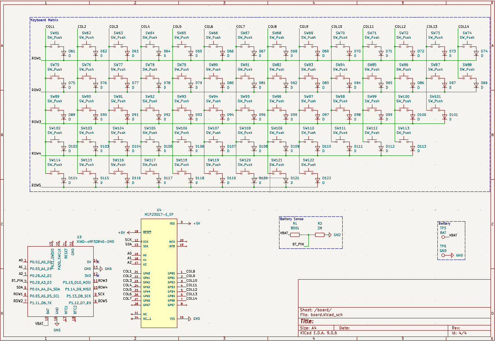
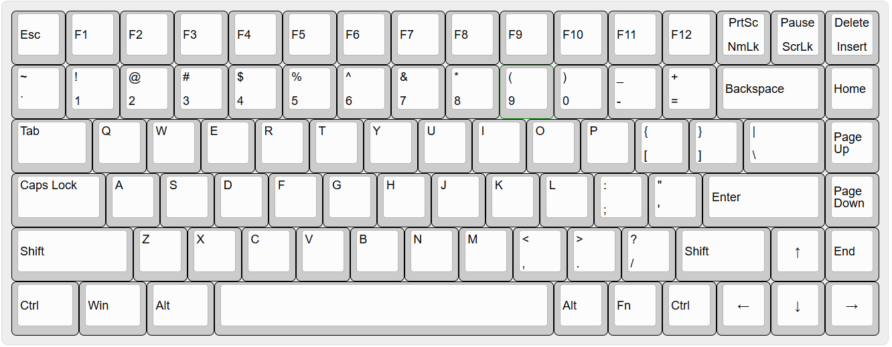
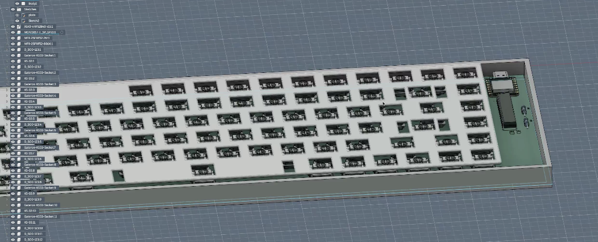
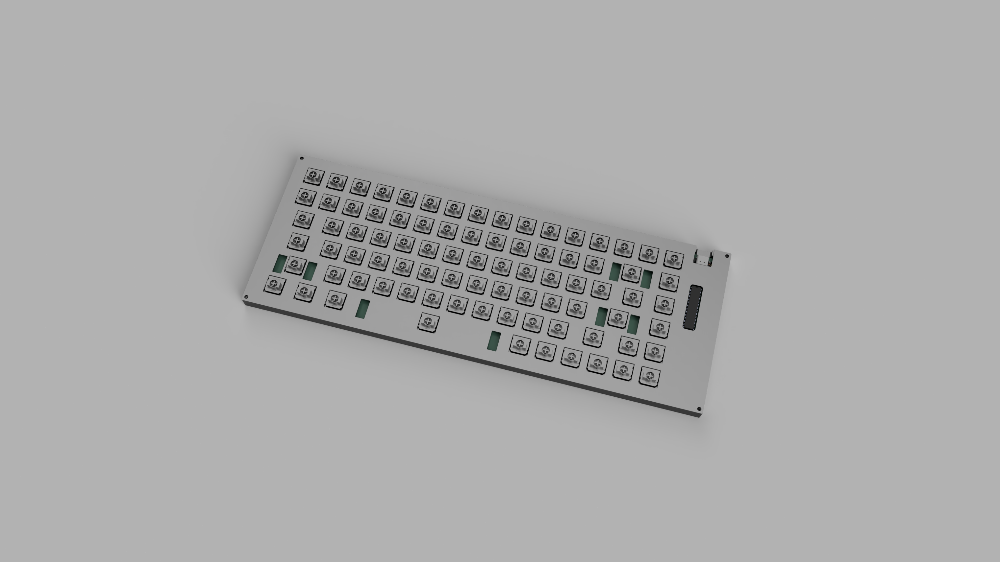
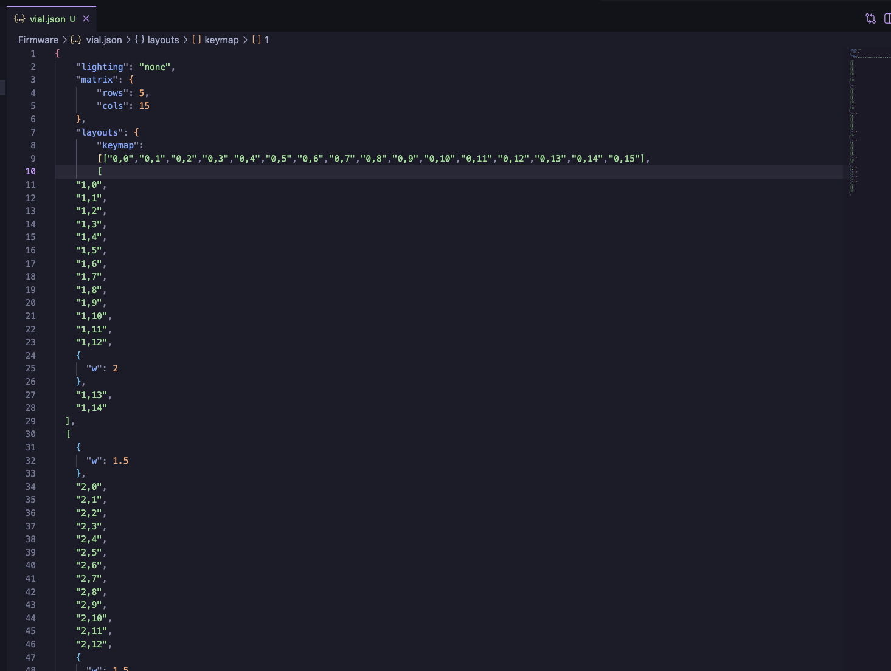
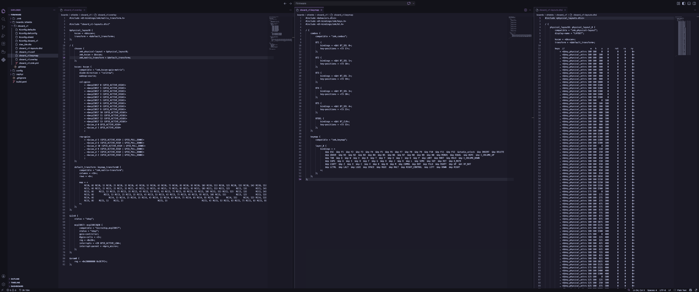
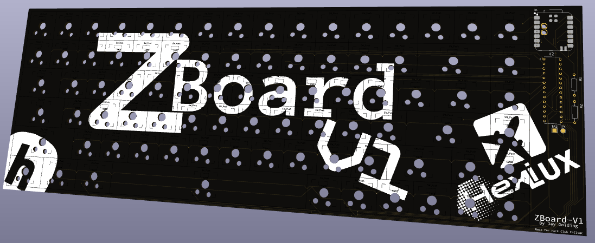
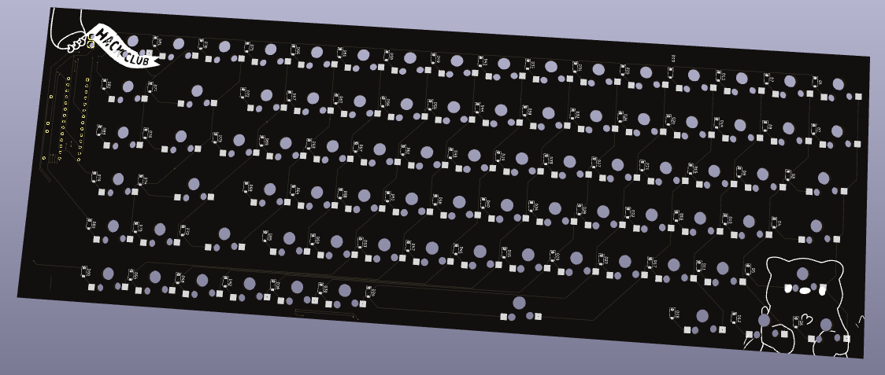
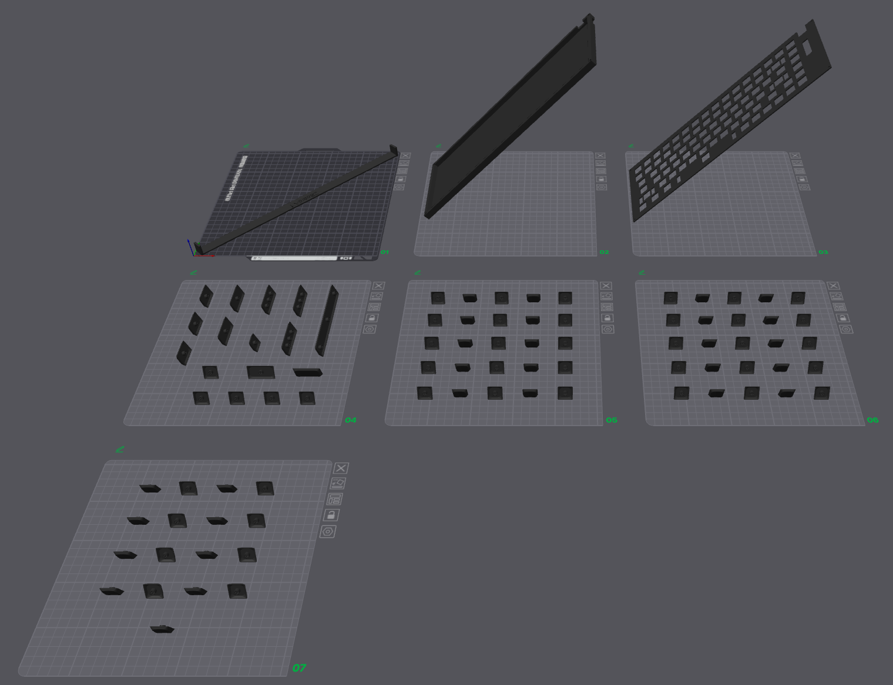

## March 17th
### Time spent: 1 hour
I began the initial schematic and research for my custom keyboard, ZBoard. I had to find the right resistors, but other than that, it was pretty simple due to the blueprint keyboard guide. 

Next step will be footprint, then BOM, then case designing.

## March 18th
### Time spent: 12 minutes
I've done some research and I decided I want to do a top-mount keyboard.
External images are not supported. View original

I might try and model and 3d print the switch plate, or I might buy a metal one. I have also made the decision to not integrate a usb hub into this keyboard design. I would like to keep it minimal.

I will also be using low profile switches and I want it to be hot swap.

Next step will be routing the PCB.

## March 19th
### Time spent: 2 hours 37 minutes
Switched to 75% keyboard for need of arrow keys and delete. Began routing pcb, took ages and only around halfway.
New Layout:

## March 20th
### Time spent: 40 minutes
I finished routing the pcb. The process was slow and painful due to the many overlapping row and column lines that I had to route, but I managed to do it on only the front and back. This will minimize cost when I get the pcb made. Here's a photo of the finalized routing:

The next step will be to make the outline of the pcb and then I think I'll do some silkscreen work to customize it and make it look really cool. Following that, it'll be time to make a BOM, order the pcb, and start working on the case and plate.

All in all, I'm very excited about where this project is heading, and I hope it goes well in the end!

## March 21st
### Time spent: 2 hours 27 minutes
I realized that my hot swap sockets were on the wrong side, so I had to switch them. Then I fully rerouted the PCB and also added the 3d models so I could preview it. It's cool!
  
The next step will be the BOM and case.

## March 22nd
### Time spent: 4 hours 41 minutes
So this is beginning to get waaaaay more painful. When I finished routing, I thought I got the hard bit out of the way, but nope. The case is just research and pain. Multiplied by the fact that I'm using low profile switches, which means there's less existing documentation for me to draw from. It's painful, but I'm working on it. Here's the case so far (it's very incomplete)

The next step will be to continue designing the case, and eventually writing firmware and then shipping and ordering everything.

Finalized the case, although I will need to add a tilt mechanism probably, but other than that, I think it's pretty good. I chose to use heat-set inserts and screws to attach the plate to the body, as this is the easiest and most secure way for me to achieve it.

Next I'll add a tilting mechanism to the case and then start working on the renders and firmware!

## March 23rd
### Time spent: 45 minutes
I simply added a kickstand to the keyboard because I like having functioning wrists, and I began animating a cool product trailer. I decided I wanted a trailer because it looks so freaking cool, and I'll be more proud of the project because of it. 
  
Next steps are more animating of the trailer, and then firmware.

## March 26th
### Time spent: 2 hours 21 minutes
I updated the BOM with shipping and the PCB, finished the renders and the video. Now my renders look all fancy and I love it!!! Then I fixed my readme so it actually says the stuff it needs to. Then I made my a journal.md in the repo itself.
Here are my fancy renders:

## March 28th
### Time spent: 5 hours 15 minutes
Started working on the firmware. I decided to use Vial because it's more customizable and better in the long run.

In these long 5 hours, I did the firmware. In one go. I don't know why I did it, it was a stupid idea. But I did it anyway. I started by trying to use QMK and vial because it is very configurable and C is nice. That turned out to be a terrible mistake due to my use of the MCP23017 I/O expander in my design. There is also the fact that QMK is not at all developed for wireless, so that ship sailed after the first 2 hours. So I boldly ventured into the ZMK. I had to learn whole new languages and do a lot of research. Eventually I managed to configure the batteries, bluetooth, and just normal keyboard function into a firmware that might work. Fingers crossed I guess. Anyway, that's enough of that rant, here's a picture of some code:

## March 31st
### Time spent: 1 hours 28 minutes
I finished up the silkscreen for the PCB, and it's looking very nice! I added some logo text, some of my previous projects, and some hack club branding, all making it come together to look like a very finished PCB.
Here's some nice images of the silkscreen:

Next I'll need to work on my Zine and do some more polishing up in order to reach the number of hours I need to get my grant.

## April 2nd
### Time spent: 46 minutes
I worked on and finished my Zine, and added some required files for submission. I'm considering 3D printing my keycaps because I don't have enough hours for my current BOM, but we'll see what happens.
Here's my Zine:

## April 3rd
### Time spent: 2 hours 15 minutes
Due to funding issues, I decided to switch to 3D printed keycaps, which only use 70g of filament. I used an existing model and then made the 1.25u, 1.5u, 1.75u, 2u, 2.25u, and 6.25u versions, so now I've saved extra money. I also switched from DigiKey to LCSC because shipping is way cheaper and so are the parts, so this might be the last journal, it's been a great experience and I can't wait to continue fallout and eventually reach 60 hours!

Here's the sliced 3D prints:

## April 4th
### Time spent: 1 hour 57 minutes
Firmware. I despise it. With the carry that is Large Language Models, I was able to get my firmware to build. So painful. I never want to experience that again. But this is it. All parts of the design are complete. I can now rest easy knowing I just have to build it. And I enjoy soldering, so it should be a treat.
Here's the file that caused me hours of pain just to get: 
