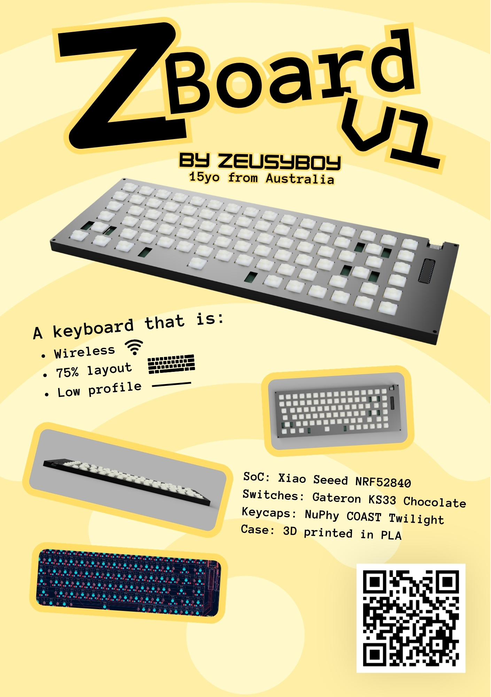
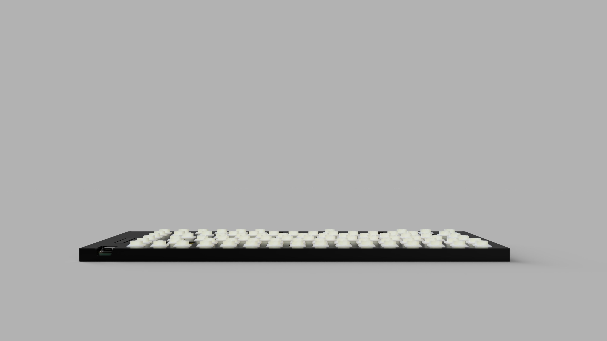
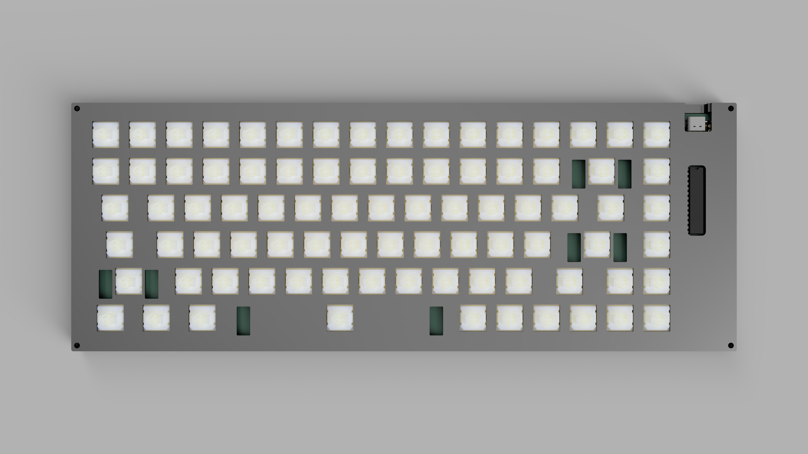
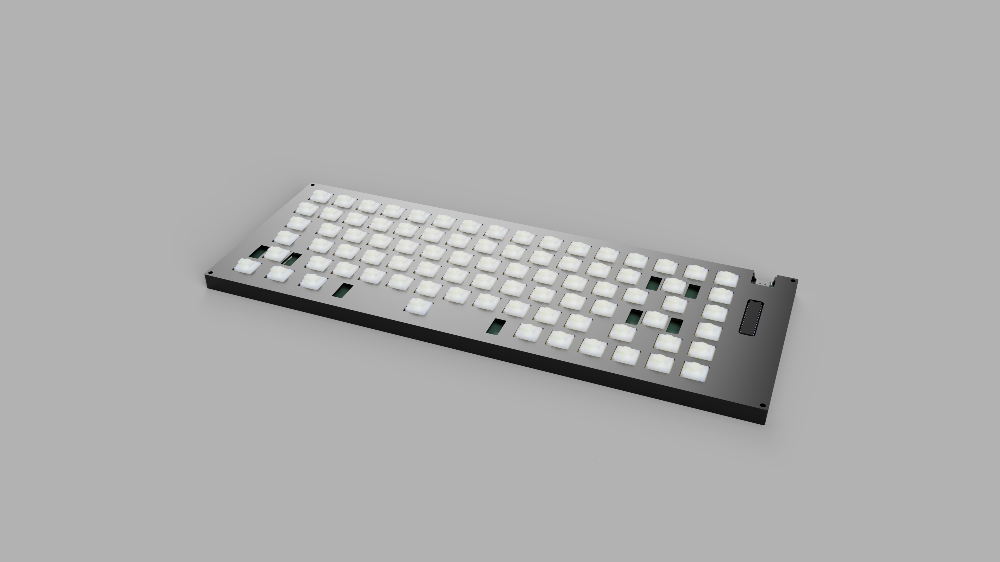
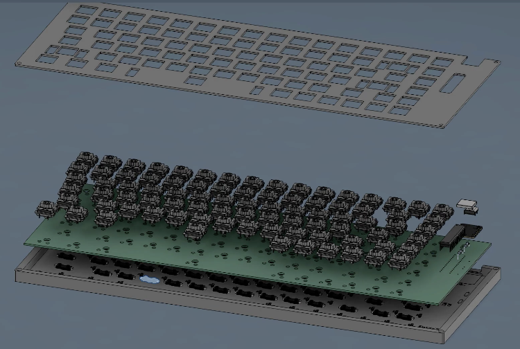
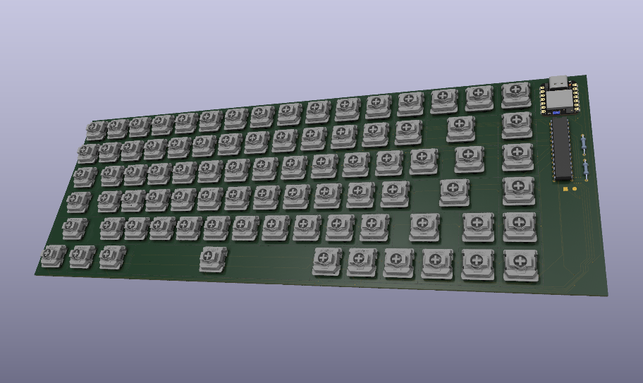
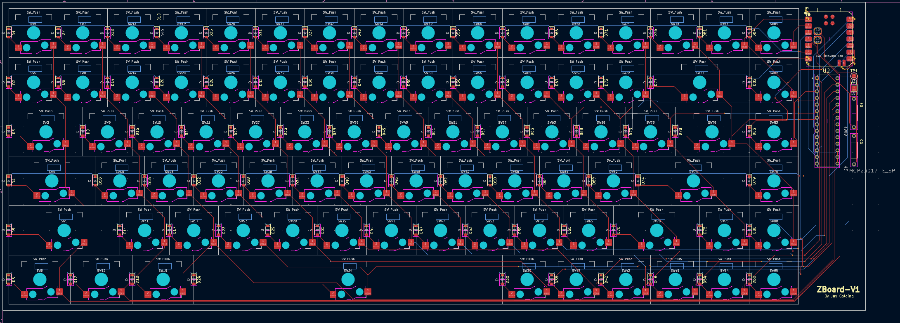

# ZBoard-V1
Video: https://github.com/ZeusyBoy98/ZBoard-V1/blob/main/IMG/ZBoard-V1-Video.mp4.  
The ultimate 75% wireless keyboard that fits my needs!  
Made for Hack Club Fallout.

## Zine

## What does it do?
It's a 75% low profile wireless keyboard with Gateron KS33 Chocolate Switches, NuPhy COAST Twilight Keycaps, and a 3D printed shell and plate.

## Why?
Because I hate my current keyboard options. I have a Corsair K70 Core which sucks for anything other than gaming, and some old HP keyboard which doesn't register switch presses half the time. So I decided to build my own keyboard. My requirements were for it to be wireless, so that I could use it untethered, low profile & 75%, so it can fit anywere for any situation, and use switches which I really enjoy pressing. In the end, this is the design I came up with and I could not be happier.

## Renders

## Designing

