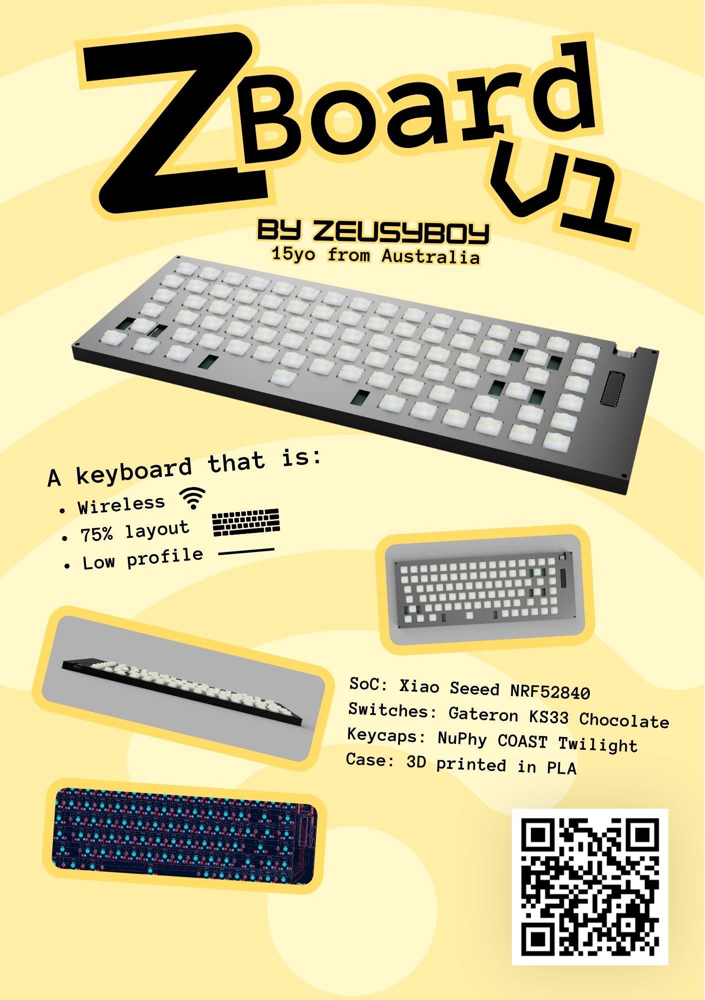
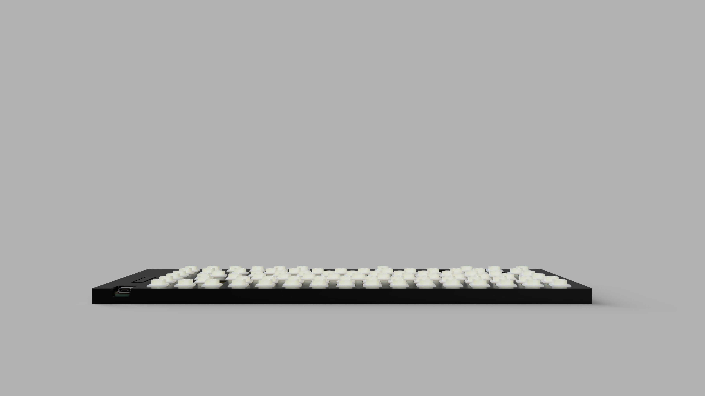
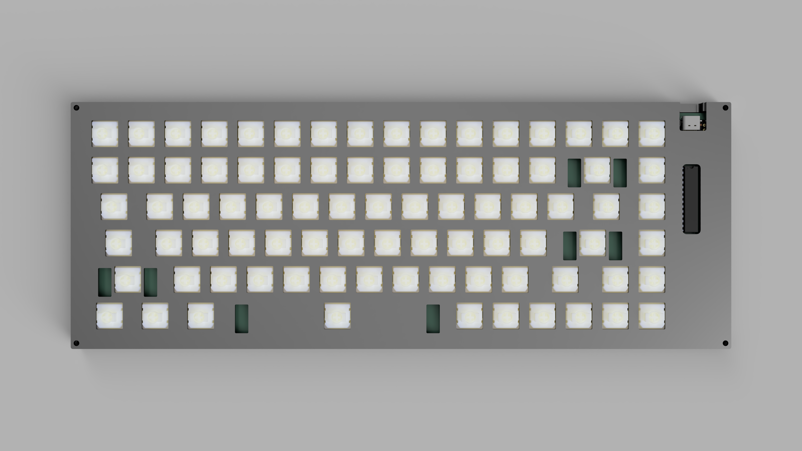
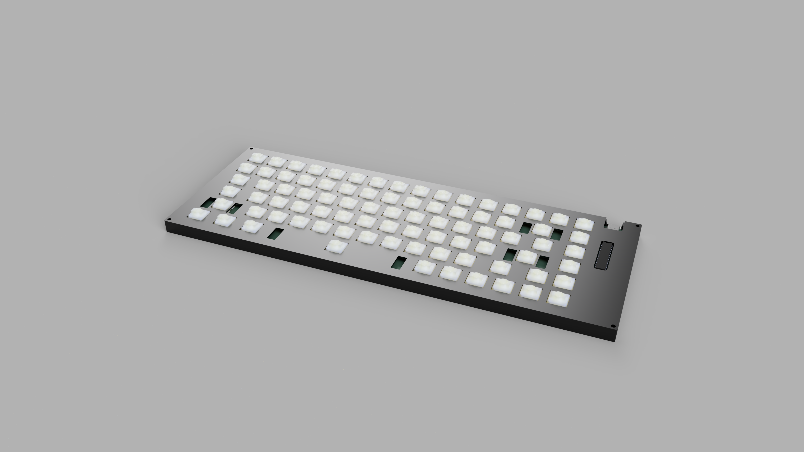
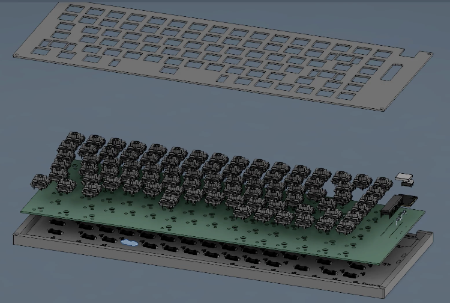
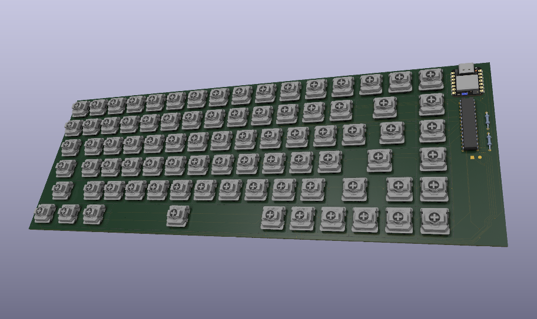
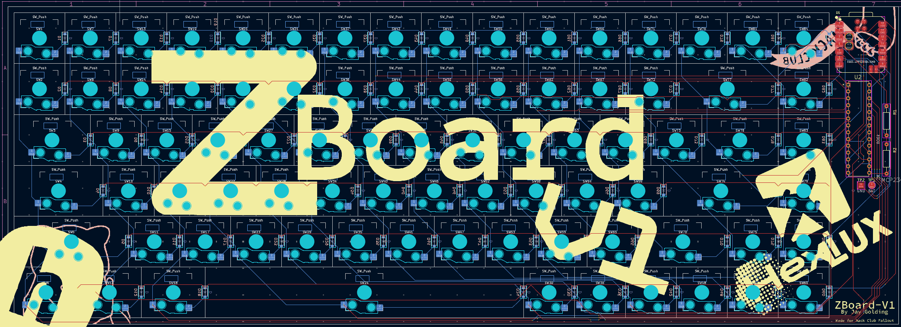

# ZBoard-V1
Video: https://github.com/ZeusyBoy98/ZBoard-V1/blob/main/IMG/ZBoard-V1-Video.mp4.  
The ultimate 75% low-profile keyboard that fits my needs!  
Made for Hack Club Fallout.

## Zine

## What does it do?
It's a 75% low-profile keyboard with Gateron KS33 Chocolate Switches, NuPhy COAST Twilight Keycaps, and a 3D printed shell and plate.

## Why?
Because I hate my current keyboard options. I have a Corsair K70 Core which sucks for anything other than gaming, and some old HP keyboard which doesn't register switch presses half the time. So I decided to build my own keyboard. My requirements were for it to be low profile & 75%, so it can fit anywere for any situation, and use switches which I really enjoy pressing. In the end, this is the design I came up with and I could not be happier.

## Motivation
I don't have a good keyboard. My options are a gaming keyboard that double presses, or a membrane keyboard that doesn't press. This should fix both those issues and be actually enjoyable to use.

## How?
In order to make this project for yourself, you'll need to purchase/3D print the items in the bill of materials below.

| Qty      | Component                     | Link                                                                                                         | Price Individual (USD)        | Price Sum (USD)           |
| -------- | ----------------------------- | ------------------------------------------------------------------------------------------------------------ | ----------------------------- | ------------------------- |
| 100      | Diode                         | [LCSC](https://www.lcsc.com/product-detail/C917030.html?s_z=n_1N4148W)                                       | 0.0058                        | 0.58                      |
| 1        | Switches (110 KS33 Chocolate) | [Gateron](https://www.gateron.com/products/gateron-ks-33-low-profile-20-chocolate-switch?VariantsId=11140)   | 39.60                         | 39.60                     |
| 1        | Hotswap Sockets               | [Gateron](https://www.gateron.com/products/gateron-low-profile-switch-hot-swap-pcb-socket?VariantsId=10234)  | 11.00                         | 11.00                     |
| 1        | Stabilizers                   | [Gateron](https://www.gateron.com/products/gateron-low-profile-plate-mounted-stabilizer?VariantsId=10540)    | 8.00                          | 8.00                      |
| 1        | Orpheus Pico                  | Hack Club Flavourtown                                                                                        | Already owned                 | Already owned             |
| 1        | Heat set insert               | [Core Electronics](https://core-electronics.com.au/brass-heat-set-inserts-for-plastic-m3-x-3mm-50-pack.html) | Already owned                 | (8.39)                    |
| 1        | 5mm M3 Screw                  | [Core Electronics](https://core-electronics.com.au/machine-screw-m3-5mm-length-phillips-25-pack.html)        | Already owned                 | (2.24)                    |
| 1        | Case Pieces                   | CAD/ZBoard-V1-Print.3mf                                                                                      | 3D printing (220g filament)   |                           |
| 1        | Keycap Set                    | CAD/ZBoard-V1-Print.3mf                                                                                      | 3D printing (70g filament) | (Total 3D printing: 4.61) |
| 1        | PCB                           | PCB/Gerbers.zip                                                                                              |                               | 21.90                     |
| Shipping |                               |                                                                                                              |                               | 8.60+21.28+10.77=40.65    |
| Total    |                               |                                                                                                              |                               | 99.83                     |

### Build Guide:

#### 1. Preparation 
Before starting, make sure you have:
<ul>
<li>All components from the BOM
<li>A soldering iron + solder
<li>Tweezers (there are lots of small components)
<li>Flux (helpful)
<li>A screwdriver
<li>A 3D printer (or get the printed parts from someone else)
</ul>

#### 2. Soldering
Take your pcb and begin soldering components to it 
Recommended order:
<ul>
<li>SMD Components (Diodes, hot swap sockets)
<li>Microcontroller (Orpheus Pico)
</ul>

#### 3. Switches + Stabilizers
Insert each individual keyboard switch first, then do the stabilizers. Make sure every switch is properly seated in the socket.

#### 4. Case + Keycaps
<ul>
<li>3D print the case pieces and keycaps.
<li>Insert heat-set inserts with soldering iron into holes in bottom part of case.
<li>Place PCB into case and screw case closed with M3 Screws
<li>Put keycaps onto switches
</ul>

#### 5. Flash ZMK firmware
<ul>
<li>Plug the keyboard in via USB
<li>Double press the reset button to enter bootloader
<li>A new USB drive will appear
<li>Copy Firmware/zmk.uf2 onto the new USB drive
<li>Wait for Firmware to finish flashing
</ul>

Enjoy your ZBoard!

## Renders

## Designing

